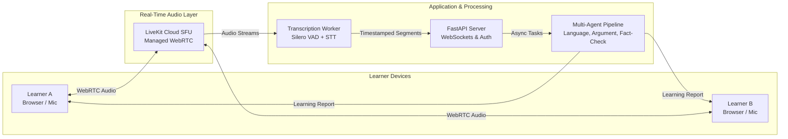

# DebateSpeak AI

[](LICENSE)
[](https://www.python.org/)
[](https://fastapi.tiangolo.com/)
[](https://react.dev/)
[](https://livekit.io/)
[](https://www.docker.com/)


---

## 1. Overview

**DebateSpeak AI** is an open, real-time spoken debate and English fluency learning platform. Two learners enter an audio room to debate an assigned topic through live microphone exchange. As the debate unfolds, an asynchronous, multi-agent AI pipeline listens to speaker-isolated audio tracks and generates grounded evaluations covering spoken fluency, argument structure, and evidence validity.

> **Core Mission:** Bridge the gap between passive English comprehension and spontaneous, unscripted argumentative speech through structured peer interaction and grounded AI coaching.



---

## 2. Key Capabilities

- **Low-Latency Peer Audio (LiveKit Cloud SFU):** High-reliability WebRTC media exchange across NAT/firewalls with isolated per-speaker audio tracks.
- **Real-Time Speech Processing:** Voice Activity Detection (Silero VAD), pause and speech rate metrics, and streaming speech-to-text with word-level timestamps.
- **Multi-Agent Evaluation Engine:**
  - **Language Coach:** Evaluates spoken grammar, CEFR-aligned vocabulary breadth, and filler-word patterns.
  - **Argument Coach:** Analyzes argument claims, logical structure, rebuttals, and informal fallacies.
  - **Fact Investigator & Evaluator:** Web search retrieval to fact-check empirical claims made during rounds.
  - **Consensus Engine:** Synthesizes multi-agent feedback with strict quote-grounding guards (verbatim quote citation required).
- **Personalized Longitudinal Reports:** Tracks speech rate, filler frequency, argument quality, and vocabulary progression across debates over time.

---

## 3. Technology Stack

| Layer | Primary Technologies | Purpose |
|---|---|---|
| **Frontend** | React 18, TypeScript, Vite, Tailwind CSS, Lucide Icons | Responsive SPA, room lobbies, live transcript view, interactive reports |
| **Backend API** | FastAPI (Python 3.11+), SQLAlchemy 2 (async), Pydantic v2 | REST endpoints, WebSocket hub, JWT auth, room lifecycle state machine |
| **Data & Cache** | PostgreSQL 16, Redis 7 (ARQ task queue) | Relational persistence, session state, background job orchestration |
| **Real-Time Audio** | LiveKit Cloud SFU, LiveKit Client SDK | Low-latency WebRTC audio streaming, per-speaker track routing |
| **Speech Pipeline** | Silero VAD, STT Adapter (Cloud streaming API / local fallback) | Voice segmentation, word-level timestamps, pause detection |
| **AI Intelligence** | LLM Adapter Protocol, Search Adapter Protocol | Multi-agent analysis, grounding validation, factual verification |
| **Infrastructure** | Docker Compose, Caddy (TLS/HTTPS reverse proxy) | Reproducible multi-service deployment with mic-permission TLS support |

---

## 4. Documentation & Architecture

Comprehensive design, roadmap, and implementation documents are organized within the [`docs/`](docs/) directory:

- 🏛️ **[Software Architecture Specification](docs/architecture/SOFTWARE_ARCHITECTURE_SPEC.md):** Complete SRS, system invariants, database schema, API contracts, and security models.
- 🗺️ **[Development Roadmap](docs/ROADMAP.md):** 5-sprint incremental delivery milestones and build plan.
- 📋 **[Engineering Task Breakdown (TASKS.md)](docs/management/SPRINT_TASKS.md):** Multi-sprint work breakdown structure and subsystem assignments.
- 🧪 **[Quality Assurance & Testing Plan](docs/testing/TESTING_PLAN.md):** Unit, integration, audio chaos, and golden-set LLM evaluation protocols.
- 🤝 **[Team Collaboration Contract](docs/management/TEAM_CONTRACT.md):** Team commitments, communication protocols, and meeting cadences.
- 🎓 **[Course & Sprint Deliverables](docs/assignments/):** Specific course project documentation and compiled LaTeX reports ([`report/build/report.pdf`](report/build/report.pdf)).

---

## 5. Quick Start (Development)

### Prerequisites
- [Docker Desktop](https://www.docker.com/) (Docker Compose v2+)
- [Python](https://www.python.org/) 3.11+
- [Node.js](https://nodejs.org/) v20+ & [pnpm](https://pnpm.io/)

---

### Step 1: Environment Setup
Copy the sanitized environment template to create your local `.env`:

**Windows (PowerShell):**
```powershell
Copy-Item .env.example .env
```
**macOS / Linux (Bash):**
```bash
cp .env.example .env
```

---

### Step 2: Start Local Infrastructure (Docker Compose)
Launch PostgreSQL 16, Redis 7, and the LiveKit WebRTC server in the background:

```bash
docker compose up -d
```

Verify that all three containers are healthy:
```bash
docker compose ps
```

| Service | Container Name | Local Port | Purpose |
|---|---|---|---|
| **PostgreSQL 16** | `debatespeak-db` | `5432` | Relational persistence (users, debate rooms, transcripts, reports) |
| **Redis 7** | `debatespeak-redis` | `6379` | In-memory cache & async worker queue (ARQ) |
| **LiveKit SFU** | `debatespeak-livekit` | `7880` (HTTP/WS), `7881` (TCP), `7882/udp` | Real-time audio routing (offline `--dev` mode) |

---

### Step 3: Verify Services

Test connectivity and health for each service:

```powershell
# 1. Test PostgreSQL connectivity (accepting connections)
docker exec debatespeak-db pg_isready -U debatespeak -d debatespeak

# 2. Test Redis responsiveness (Expects: PONG)
docker exec debatespeak-redis redis-cli ping

# 3. Test LiveKit WebRTC server (Expects: HTTP 200)
curl.exe http://localhost:7880/
```

---

### Step 4: Teardown
To stop the services without losing database records:
```bash
docker compose down
```
*(To completely reset and wipe local database data, use `docker compose down -v`)*

---

## 6. Project Team

| Student ID | Full Name | Lead Role |
|---|---|---|
| **24125047** | **Nguyễn Bảo Minh Triết** | **Team Leader & Frontend / WebRTC Lead** |
| **24125078** | **Nguyễn Hồng Tấn Tài** | **Backend & Real-Time Media Lead** |
| **24125058** | **Nguyễn Anh Khoa** | **AI Audio & Speech Pipeline Lead** |
| **24125107** | **Trần Lê Anh Tuấn** | **AI Orchestrator & Analysis Lead** |
| **24125093** | **Nguyễn Đình Thiên Lộc** | **DevOps & QA / Fact-Checking Lead** |

---

## License

This project is licensed under the [MIT License](LICENSE).
