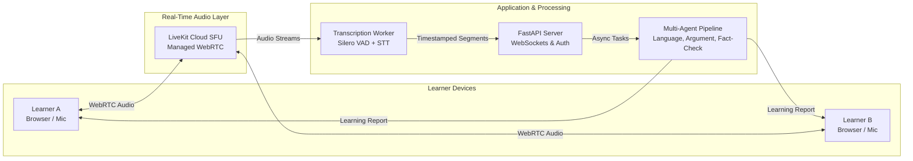

# DebateSpeak AI — Project Assignment 1 (PA1)

[](https://github.com)
[](https://github.com)
[](LICENSE)

*Author: Group Member 1 | Reviewer: Group Member 2 | Editor: Group Member 3*

---

## 1. Project Overview

**DebateSpeak AI** is a web-based, real-time spoken debate and English-learning platform. Two human learners enter a shared audio room, debate an assigned topic through their microphones, and receive comprehensive, multi-agent AI feedback covering spoken English fluency, argument structure, and evidence validity.

> **Elevator Pitch:** DebateSpeak AI combines live peer debate with AI coaching to help intermediate English learners develop unscripted conversational fluency, spontaneous rebuttal skills, and critical thinking.



---

## 2. Incremental Development Model (5 Sprints mapped to PA1–PA5)

The project follows a strict **Incremental Development Lifecycle**, delivering functional, verified vertical slices across **5 Sprints** that align directly with the course assignments:

| Sprint | Assignment | Primary Capability Delivered | Verification Milestone / Build |
|---|---|---|---|
| **Sprint 1** | **PA1 (Weeks 1–2)** | **Project Conception & Setup:** 10 Functional Groups, Survey, Contract, Dev Process | CI pipeline green, Docker Compose skeleton, LaTeX report |
| **Sprint 2** | **PA2 (Weeks 3–4)** | **Planning & Core Foundation:** Project Plan, Vision Doc, Spec Kit init in `/src` | **Build 1:** User Auth + Room Lobby state machine skeleton |
| **Sprint 3** | **PA3 (Weeks 5–6)** | **Use-Case Modeling & First Functional Slice:** Specs, UI prototypes, Changes.md | **Build 2:** Full-stack implementation of FG-03 + narrated video demo |
| **Sprint 4** | **PA4 (Weeks 7–8)** | **Architecture & Second Slice:** C4 Context/Container/Component/Deployment | **Build 3:** Full-stack audio & streaming STT (FG-04 & FG-05) + demo |
| **Sprint 5** | **PA5 (Weeks 9–10)** | **Testing, Hardening & Final Presentation:** Test plan, refined tests, reflective report | **Build 4 (Final):** 15-min live demo showcasing all 10 FGs |

---

## 3. Repository & Documentation Structure

This repository is organized strictly by course Project Assignments (PA1–PA5):

```text
Project_2/
├── README.md                                  <-- Repository Landing Page & Project Navigation
├── AGENTS.md                                  <-- AI Assistant Operating Rules & Invariants
├── .env.example                               <-- Sanitized Configuration Template
├── report/
│   ├── report.tex                             <-- Academic LaTeX Report (PA1 Parts A-E)
│   ├── .latexmkrc                             <-- latexmk Build Configuration
│   └── build/report.pdf                       <-- Compiled Academic PDF Deliverable
├── docs/
│   ├── pa1/                                   <-- Project Assignment 1 Deliverables
│   │   ├── PROJECT_PROPOSAL.md                <-- Part B: Project Proposal (10 pts)
│   │   ├── EXISTING_APP_SURVEY.md             <-- Part C: Existing App Survey (10 pts)
│   │   ├── TEAM_CONTRACT.md                   <-- Part D: Team Contract (5 pts)
│   │   └── DEV_TOOLS_AND_PROCESS.md           <-- Part E: Tools & Process Setup (5 pts)
│   ├── pa2/                                   <-- PA2 Roadmap & Upcoming Specs (Part A-D)
│   ├── pa3/                                   <-- PA3 Roadmap & Use-Case Model (Part A-F)
│   ├── pa4/                                   <-- PA4 Roadmap & C4 Architecture (Part A-F)
│   ├── pa5/                                   <-- PA5 Roadmap & QA Test Plan (Part A-D)
│   │   └── TESTING_PLAN.md                    <-- Comprehensive Test Plan & QA Protocols
│   ├── architecture/
│   │   └── SOFTWARE_ARCHITECTURE_SPEC.md      <-- Exhaustive SRS & System Architecture Spec
│   ├── management/
│   │   ├── SPRINT_TASKS.md                    <-- 5-Sprint Work Breakdown Structure (TASKS.md)
│   │   ├── TEAM_CONTRACT.md                   <-- Active Team Contract
│   │   └── DEV_TOOLS_AND_PROCESS.md           <-- Active Development Guidelines
│   └── reference/
│       └── ORIGINAL_PROMPT_REFERENCE.md       <-- Reference System Directives
└── [src/ : source code - scheduled starting PA2 via Spec Kit]
```

---

## 4. Quick Document Index (PA1 Deliverables)

| Course Section | File Location | Key Contents | Points |
|---|---|---|---|
| **Section B** | [`docs/pa1/PROJECT_PROPOSAL.md`](docs/pa1/PROJECT_PROPOSAL.md) | Introduction, 2 Actors, 10 Distinctive Functional Groups, AI Feature Description | **10 pts** |
| **Section C** | [`docs/pa1/EXISTING_APP_SURVEY.md`](docs/pa1/EXISTING_APP_SURVEY.md) | Survey of ArguFight & Khaos Live, Screenshots, Workflows, Differentiation | **10 pts** |
| **Section D** | [`docs/pa1/TEAM_CONTRACT.md`](docs/pa1/TEAM_CONTRACT.md) | 5 Full-Stack Roles, Communication Plan, 5-Sprint Schedule, Code Standards | **5 pts** |
| **Section E** | [`docs/pa1/DEV_TOOLS_AND_PROCESS.md`](docs/pa1/DEV_TOOLS_AND_PROCESS.md) | Scrum Process, Jira Rules, Git Workflow, Spec Kit, Multi-Sprint WBS Tasks | **5 pts** |
| **Academic Report**| [`report/report.tex`](report/report.tex) | LaTeX source compiled with `latexmk` outputting to `report/build/report.pdf` | **Compiled** |
| **Technical Spec** | [`docs/architecture/SOFTWARE_ARCHITECTURE_SPEC.md`](docs/architecture/SOFTWARE_ARCHITECTURE_SPEC.md) | Complete System SRS, Data Models (Postgres), API Schemas, Invariants | *Reference* |
| **Test & QA** | [`docs/pa5/TESTING_PLAN.md`](docs/pa5/TESTING_PLAN.md) | Unit, Integration, Audio Chaos, Golden-Set Evaluations, Usability Protocol | *Reference* |

---

## 4. Confirmed Tech Stack

- **Frontend:** Vite + React (TypeScript) + Tailwind CSS (Responsive Single-Page App)
- **Backend:** FastAPI (Python 3.11+), PostgreSQL 16, Redis 7 (ARQ task queue & pub/sub)
- **Audio Transport:** Managed LiveKit Cloud Free Tier (eliminates STUN/TURN & UDP NAT barriers)
- **Speech-to-Text (STT):** Configurable STT adapter interface (streaming cloud STT API with local engine fallback)
- **LLM Multi-Agent Engine:** Configurable LLM adapter interface supporting cloud API providers or local endpoints
- **Deployment:** Containerized via Docker Compose with reverse proxy providing TLS/HTTPS for browser mic permissions

---

## 5. Team Identification (PA1 Part A)

- **Group Name:** Group 01 (Example)
- **Group Leader:** Member 1
- **Official Team Members & Roles:**
  1. **Nguyễn Đình Thiên Lộc** (ID: `24125093`) — DevOps & QA / Fact-Checking Lead
  2. **Nguyễn Bảo Minh Triết** (ID: `24125047`) — Frontend & WebRTC/Audio Lead
  3. **Nguyễn Hồng Tấn Tài** (ID: `24125078`) — Backend & Real-Time Media Lead
  4. **Nguyễn Anh Khoa** (ID: `24125058`) — AI Audio & Speech Pipeline Lead
  5. **Trần Lê Anh Tuấn** (ID: `24125107`) — AI Orchestrator & Analysis Lead

