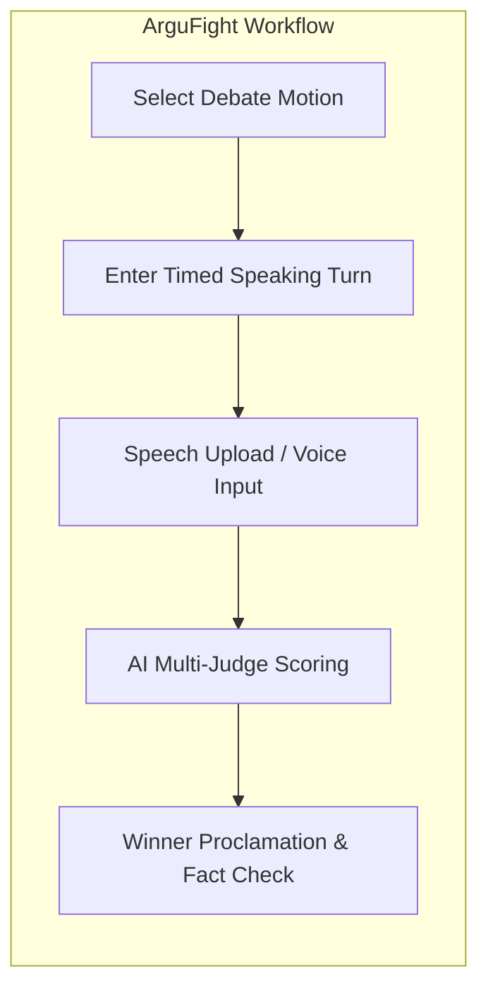
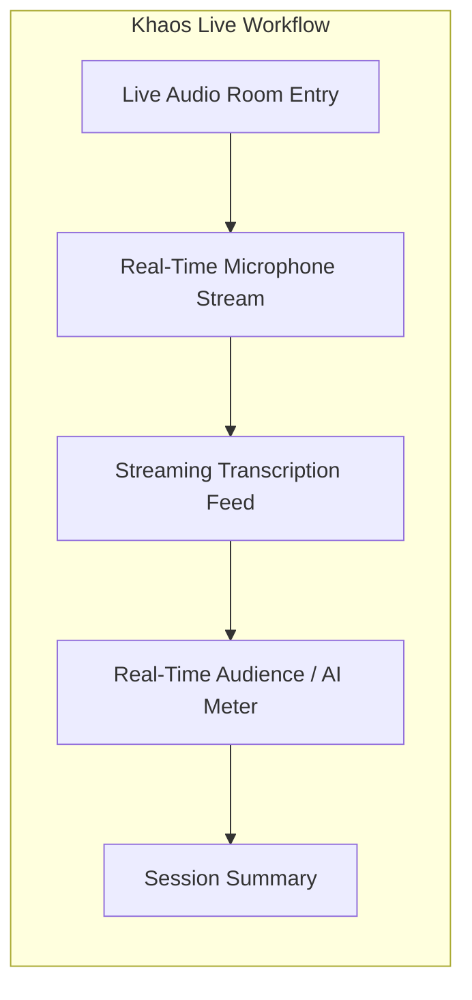

# Part C: Existing App Survey — DebateSpeak AI

*Author: Group Member 2 | Reviewer: Group Member 1 | Editor: Group Member 4*

| Field | Description |
|---|---|
| Course | CS300 / CSC13002 — Introduction to Software Engineering |
| Document | **Part C: Existing Web & Mobile App Survey** |
| Score Allocation | Part C (10 Points) |

---

## 1. Survey Methodology & App Selection

*Performed by: Member 2 | Reviewed by: Member 1 | Edited by: Member 4*

To evaluate the current state of market solutions and identify architectural and user experience gaps, our team surveyed existing applications operating at the intersection of AI debate judging, live speech transcription, and English speaking practice.

We selected **two primary directly comparable platforms**:
1. **ArguFight:** A modern web-based debate platform featuring AI judging, voice input, and automated fact checking.
2. **Khaos Live:** A real-time debate arena featuring live spoken interactions, continuous transcription, and algorithmic debate scoring.

Additionally, we benchmarked against **ELSA Speak** to analyze mobile-first language learning interfaces and speech-evaluation UX patterns.

---

## 2. In-Depth Survey: App 1 — ArguFight

*Performed by: Member 2 | Reviewed by: Member 3 | Edited by: Member 1*

### 2.1 Overview & Core Focus
**ArguFight** focuses on structured, competitive online debates. It allows participants to debate topics either through text or asynchronous voice inputs and uses multiple AI judges to evaluate which debater presented the stronger case.

### 2.2 Key Features & Workflow Analysis



1. **Structured Turn System:** Users speak or type in fixed, alternating rounds (Constructive Speech, Cross-Examination, Rebuttal).
2. **AI Panel of Judges:** The platform simulates a panel of diverse judges (e.g., "The Logician", "The Empiricist", "The Pragmatist") who deliver a consolidated score.
3. **Automated Fact-Checking:** Flags suspicious factual claims made by participants and checks them against internal knowledge bases.

### 2.3 User Interface & Screenshots

#### Screen 1: Debate Matchmaking & Motion Selection
```text
+-------------------------------------------------------------------+
|  ARGUFIGHT                          [Search Motions]  (Profile)   |
|-------------------------------------------------------------------|
|  ACTIVE DEBATES                                                   |
|  +-----------------------------------+  +-----------------------+ |
|  | Motion: "AI will replace coders"  |  | Round: Rebuttal (2/3) | |
|  | Pro: User_Alpha | Con: User_Beta  |  | Time Left: 01:45      | |
|  +-----------------------------------+  +-----------------------+ |
|  [Join Match]  [Spectate Live]                                    |
+-------------------------------------------------------------------+
```
*Caption 1.1: ArguFight Motion Directory — Displays active and upcoming debate matches with round timers and competitive matchmaking status.*

#### Screen 2: Multi-Judge Scoring Breakdown
```text
+-------------------------------------------------------------------+
|  ARGUFIGHT POST-MATCH BREAKDOWN                                    |
|-------------------------------------------------------------------|
|  WINNER: User_Alpha (Pro) - Final Score: 87 vs 74                 |
|                                                                   |
|  [Judge: The Logician]                                            |
|  - Logic & Consistency: 90/100                                    |
|  - Critique: "Pro successfully pointed out Con's circular logic." |
|                                                                   |
|  [Judge: The Empiricist]                                          |
|  - Fact-Check Result: 2 Claims Verified, 1 Claim Flagged (Weak)  |
+-------------------------------------------------------------------+
```
*Caption 1.2: ArguFight Post-Match Verdict — Shows competitive scorecard with independent AI judge opinions, winner selection, and fact validation.*

### 2.4 Strengths & Limitations
- **Strengths:** Excellent multi-judge roleplay that exposes varied reasoning angles; strong gamification for competitive debaters.
- **Limitations:** Focuses exclusively on *who won the debate*; provides **zero language-learning feedback** (no grammar correction, no CEFR vocabulary recommendations, no pause/fluency analytics). Asynchronous turn-taking feels mechanical and lacks spontaneous conversational back-and-forth.

---

## 3. In-Depth Survey: App 2 — Khaos Live

*Performed by: Member 3 | Reviewed by: Member 2 | Edited by: Member 5*

### 3.1 Overview & Core Focus
**Khaos Live** is a live streaming debate platform where users enter live voice/video rooms to argue controversial topics in front of a live audience, accompanied by real-time speech transcription and dynamic AI scoring.

### 3.2 Key Features & Workflow Analysis



1. **Synchronized Live Voice Rooms:** Two speakers talk concurrently with real-time audio transport.
2. **Real-Time Scrolling Transcript:** Captures speech continuously, allowing listeners to follow the discussion textually.
3. **Sentiment & Engagement Meter:** Live dynamic bars measuring persuasive impact during speech delivery.

### 3.3 User Interface & Screenshots

#### Screen 1: Live Spoken Room & Real-Time Transcript
```text
+-------------------------------------------------------------------+
|  KHAOS LIVE: Room #402                      [Audience: 124] (Exit)|
|-------------------------------------------------------------------|
|  [Speaker 1: David] (MIC ON)        [Speaker 2: Elena] (LISTENING)|
|  (( Live Waveform Visualization ))                                |
|-------------------------------------------------------------------|
|  REAL-TIME TRANSCRIPT FEED                                        |
|  [David 02:14]: "The economic data clearly shows inflation..."    |
|  [Elena 02:18]: "That data ignores regional supply constraints!"  |
+-------------------------------------------------------------------+
```
*Caption 2.1: Khaos Live Room Interface — Two speakers engage over live audio while a continuous transcript stream renders in real time.*

#### Screen 2: Real-Time Persuasion Gauge
```text
+-------------------------------------------------------------------+
|  PERSUASION IMPACT GAUGE                                          |
|-------------------------------------------------------------------|
|  David (Pro):  [=====================>       ] 68%                |
|  Elena (Con):  [===========>                 ] 32%                |
|  AI Observation: "Elena has not responded to David's statistics." |
+-------------------------------------------------------------------+
```
*Caption 2.2: Khaos Live Impact Analytics — Visualizes moment-to-moment audience and AI momentum shifts during live debate exchanges.*

### 3.4 Strengths & Limitations
- **Strengths:** True synchronous real-time audio environment; high emotional engagement; live transcription aids viewer accessibility.
- **Limitations:** Geared toward entertainment and social clout; no educational framework; does not assist non-native English speakers with grammar, vocabulary, or structured rebuttal development; AI metric is a superficial "persuasion score" without actionable improvement plans.

---

## 4. Comparative Synthesis & Differentiation

*Performed by: Member 1 | Reviewed by: Member 4 | Edited by: Member 2*

### 4.1 Comparative Feature Matrix

| Evaluation Dimension | ArguFight | Khaos Live | ELSA Speak | **DebateSpeak AI (Proposed)** |
|---|---|---|---|---|
| **Core Primary Purpose** | Competitive AI-judged debate | Social entertainment debate streaming | Solo pronunciation & fluency drills | **Spoken English learning & critical-thinking development** |
| **Interaction Format** | Asynchronous / turn-based audio | Synchronous real-time live room | Solo speech against automated AI prompts | **Synchronous live peer debate (2 debaters in room)** |
| **Language Pedagogy (CEFR)** | None (assumes native fluency) | None | Yes (pronunciation/phoneme focus) | **Yes (CEFR A2–C1 adapted grammar, vocabulary, fluency)** |
| **Spoken Fluency Metrics** | None | Basic talk time | Phoneme accuracy, syllable stress | **WPM, filler rate, pause duration profile, lexical diversity** |
| **Argument Structure Analysis** | High-level judge critique | Audience momentum score | None | **Claim extraction, rebuttal mapping, fallacy detection** |
| **Fact-Checking Mechanism** | Internal knowledge base | None | None | **Live search retrieval (Serper/Tavily) + 5-level verdict + sources** |
| **Post-Debate Output** | Win / Loss verdict | Engagement statistics | Pronunciation score card | **Personalized action plan with quoted transcript corrections** |

### 4.2 Key Differentiators for DebateSpeak AI
1. **Learning-First Positioning:** Unlike ArguFight and Khaos Live, DebateSpeak does not exist to crown a winner. The debate is simply the *educational vehicle* to elicit unscripted speech, while the AI functions as a personal, patient English and critical-thinking coach.
2. **Quote-Grounded Language Feedback:** Rather than generic grammar tips, the system quotes the student's exact utterance (*"You said: 'it reduce pollution' → Suggested: 'it reduces pollution'"*) and explains the grammatical rationale at their selected CEFR level.
3. **Objective Fact-Checking with Transparency:** Rather than making a definitive claim of absolute truth, DebateSpeak presents retrieved source URLs, highlights uncertainty, and explicitly flags contested statements.

### 4.3 UI/UX Patterns Adopted from Surveyed Systems
- **From Khaos Live:** We adopt the **synchronized live room pattern** featuring visual audio waveforms, speaking indicators, and an auto-scrolling live transcript panel so users can read what was said.
- **From ArguFight:** We adopt the **multi-perspective evaluation card layout**, separating language feedback, argument structure, and evidence verification into clean, tabbed post-debate cards.
- **From ELSA Speak:** We adopt the **progress trajectory visualizer** and personalized drill suggestions, translating diagnostic errors into concrete speaking exercises for the next session.
