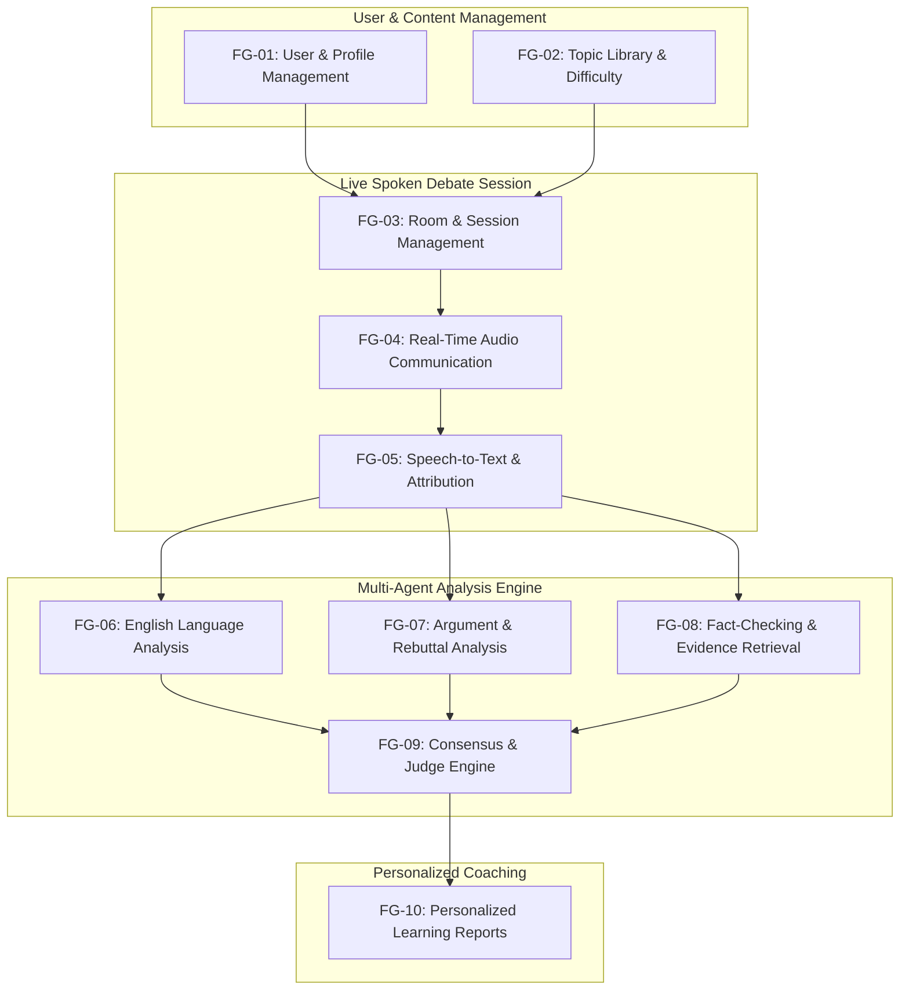
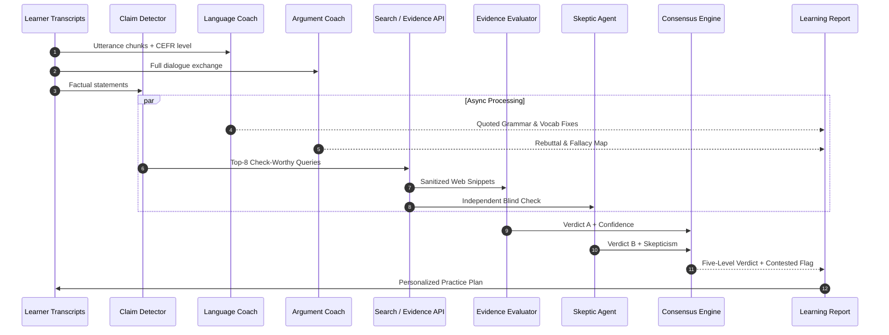

# Part B: Project Proposal — DebateSpeak AI

*Author: Group Member 1 | Reviewer: Group Member 4 | Editor: Group Member 2*

| Field | Description |
|---|---|
| Course | CS300 / CSC13002 — Introduction to Software Engineering |
| Project Title | **DebateSpeak AI: Real-Time Spoken Debate & English Learning Arena** |
| Target Type | Responsive Web Application (Vite + React SPA / Mobile-responsive) |
| Score Allocation | Part B (10 Points) |

---

## 1. Introduction & Value Proposition

*Performed by: Member 1 | Reviewed by: Member 4 | Edited by: Member 2*

### 1.1 Problem Statement
Intermediate English learners (CEFR levels A2 to C1) frequently reach a fluency plateau: they understand grammar rules and can pass written tests, but struggle with unscripted, spontaneous speaking. Traditional classroom speaking activities are scripted or role-played, and human 1-on-1 tutoring (Cambly, iTalki) is expensive and difficult to schedule frequently. Meanwhile, conventional English apps (Duolingo, ELSA Speak) focus strictly on isolated pronunciation drills or superficial conversational small-talk, failing to challenge learners with extended arguments, rebuttal under pressure, or logical structure.

### 1.2 Proposed Solution
**DebateSpeak AI** is a web-based, live peer-to-peer debate arena designed specifically for English language learning. Two human users enter a synchronized, audio-first debate room in their browsers. Over real-time microphones, they debate an engaging social or academic topic. 

While the debate occurs, the system:
1. Streams and isolates each participant's voice over dedicated WebRTC audio tracks.
2. Generates a live, speaker-attributed transcript with word-level timestamps.
3. Automatically runs a multi-agent evaluation pipeline that analyzes language quality (grammar, vocabulary, fluency, pause metrics), maps argument structure (claims, counterarguments, rebuttals), and fact-checks factual assertions against retrieved evidence.
4. Generates an actionable, personalized post-debate learning report calibrated to the learner's self-assessed CEFR level.

Debate serves as the **high-engagement practice activity**; the AI coaching pipeline serves as the **developmental feedback engine**.

---

## 2. Target Users & Operating Environments

*Performed by: Member 2 | Reviewed by: Member 1 | Edited by: Member 5*

### 2.1 Primary Target Users
1. **University & College Students:** Learners preparing for international speaking examinations (IELTS Speaking Part 3, TOEFL iBT Independent & Integrated Speaking) who need structured practice expressing abstract opinions and handling rebuttals under time limits.
2. **Global Professionals:** Non-native English speakers in business, software engineering, and consulting who must present persuasive arguments, defend architectural proposals, and speak coherently in real-time meetings.
3. **High School & Academic Debaters:** Novice debaters seeking a low-stakes, automated training environment to practice rebuttal delivery before live competitions.

### 2.2 User Actors (Minimum 2 Required)
The system defines two primary human actors with role-based access control:
- **Learner / Debater (Primary Actor):** Authenticates, configures target CEFR level and speaking goals, explores the topic catalog, creates/joins live debate rooms, participates via live microphone audio, views live transcripts, reviews post-debate learning reports, and tracks historical skill progress.
- **Moderator / Admin (Administrative Actor):** Manages the debate topic catalog (adding categories, assigning CEFR difficulty tags, retiring outdated topics), monitors system abuse reports, moderates flagged transcripts, manages user account suspensions, reviews LLM token costs, and configures prompt versions and feature flags.

### 2.3 Operating Environments
- **Client Platforms:** Modern desktop and laptop web browsers (Google Chrome 115+, Mozilla Firefox 115+, Microsoft Edge 115+, Apple Safari 16+) with WebRTC and microphone permissions enabled. Responsive UI supports tablet and mobile browsers.
- **Operating Systems:** OS-independent (Windows 10/11, macOS Monterey+, Ubuntu 22.04+, iOS 16+, Android 12+).
- **Network Environment:** Public Internet with WebSocket (WSS) and WebRTC (UDP/TCP) egress access over standard TLS (HTTPS).

---

## 3. Key Functional Groups (10 Distinctive Functional Groups)

*Performed by: Member 3 | Reviewed by: Member 2 | Edited by: Member 1*

The application is decomposed into **10 distinctive, non-generic functional groups**:

### FG-01: User Account & Profile Management
- **Feature Description:** Provides secure registration, authentication (Argon2id password hashing and rotating JWTs), and persistent learner profiles. Learners configure their native language, self-assessed CEFR proficiency level (A2, B1, B2, C1), and target improvement goals (e.g., "reduce filler words", "improve rebuttal structure").
- **Utility:** Ensures personalized baseline calibration so subsequent AI evaluations and topic recommendations adapt appropriately to the student's proficiency level.

### FG-02: Debate Topic & Difficulty Management
- **Feature Description:** An organized catalog of debate motions categorized by theme (Technology, Society, Education, Ethics) and tagged with CEFR difficulty levels. Administrators can curate motions, suggest target vocabulary lists, and retire dated topics; learners can search, filter, and receive level-adapted recommendations.
- **Utility:** Prevents intermediate students from being intimidated by overly academic philosophy motions while ensuring advanced C1 learners are appropriately challenged.

### FG-03: Debate Room & Live Session Management
- **Feature Description:** Manages the synchronized debate lifecycle through a formal finite state machine (`LOBBY` → `READY` → `LIVE` → `ENDED`). Handles 8-character invite code sharing, stance assignment (Pro vs. Con), synchronized countdown timers, and an explicit dual-consent gate requiring both users to approve audio transcription before the room goes live.
- **Utility:** Creates an organized, predictable stage for the debate, ensuring both participants enter with agreed-upon rules and verified privacy consent.

### FG-04: Real-Time Audio Communication
- **Feature Description:** Low-latency, two-way WebRTC voice transport powered by LiveKit Cloud. Features an interactive pre-debate microphone test modal with visual audio meters, mute/unmute toggles, active speaker visualizers, and a 60-second graceful reconnection window if a participant briefly drops off.
- **Utility:** Allows users across completely different home networks or mobile hotspots to converse with crystal-clear audio without requiring custom firewall or router port forwarding.

### FG-05: Speech-to-Text & Speaker Attribution
- **Feature Description:** A silent LiveKit transcription worker subscribes to individual participant audio tracks, detects vocal activity with Silero VAD, and streams audio to a high-speed STT engine (Groq Whisper / Deepgram streaming with local `faster-whisper` fallback). Employs track-level attribution to eliminate speaker confusion.
- **Utility:** Produces a clean, synchronized, timestamped transcript of the debate with 100% deterministic speaker attribution, enabling both live in-room reading and downstream AI processing.

### FG-06: English Language Analysis
- **Feature Description:** Computes objective spoken metrics (Words Per Minute, filler word frequencies, hesitation pause profiles, and lexical diversity MATTR) and extracts grammar and vocabulary suggestions. Every feedback item enforces a strict quote-grounding rule: the system must cite the learner's exact spoken words before offering a correction.
- **Utility:** Gives students actionable, concrete language feedback on their own unscripted speech rather than generalized grammar advice.

### FG-07: Argument & Debate Analysis
- **Feature Description:** An Argument Coach LLM parses the transcript to extract claims, evidence points, and rebuttal attempts. It assesses whether speakers answered opponent points, stayed on topic, or committed common logical fallacies (e.g., ad hominem, false dilemma, hasty generalization).
- **Utility:** Bridges the gap between pure language mechanics and persuasive reasoning, teaching learners how to defend ideas effectively in English.

### FG-08: AI Fact-Checking & Evidence Analysis
- **Feature Description:** A Fact Investigator agent identifies check-worthy factual claims made during the debate, queries trusted web sources through a search API (Serper/Tavily), and passes sanitized snippets to an Evidence Evaluator agent. Claims are assigned a 5-level verdict (Supported, Partially Supported, Contradicted, Insufficient Evidence, Not Verifiable) with source links and uncertainty indicators.
- **Utility:** Prevents debates from devolving into unsupported assertions, encouraging learners to use verified facts and teaching critical information literacy.

### FG-09: Multi-Agent Evaluation & Consensus
- **Feature Description:** Pits independent evaluation agents (Evidence Evaluator vs. Skeptic) against one another and employs a Debate Judge to score debate performance across standardized rubrics. A deterministic Consensus Engine flags claims or scores as `CONTESTED` whenever agents disagree by more than 15%, explaining the uncertainty to the user.
- **Utility:** Demystifies AI judgment by openly reporting uncertainty rather than presenting a single model's hallucinated verdict as unquestionable ground truth.

### FG-10: Learning History & Personalized Reports
- **Feature Description:** Synthesizes language metrics, argument structure, verified claims, and judge scores into a comprehensive post-debate report. Generates a personalized practice regimen (e.g., "Practice 30-second rebuttals using 'Although... nevertheless'", "Review article usage with academic nouns") and displays historical score trajectory charts.
- **Utility:** Converts a single 10-minute speaking exercise into enduring, longitudinal language acquisition.

---

## 4. Standalone AI Features & Real User Value

*Performed by: Member 4 | Reviewed by: Member 3 | Edited by: Member 1*

### 4.1 Description of the AI Architecture
DebateSpeak AI integrates a **Hierarchical Multi-Agent Orchestration Pipeline** rather than a generic single-prompt chatbot:

### 4.2 Practical Value to the End User
1. **Zero-Hallucination Language Grounding:** Conventional LLM tutors often hallucinate grammar errors that the learner never actually made. DebateSpeak enforces an automated regex/substring grounding guard that immediately drops any suggestion whose quoted text cannot be located in the verified audio transcript.
2. **Real-Time Critical Thinking & Rebuttal Coaching:** By mapping which opposing claims were answered and which were ignored, the AI teaches learners conversational agility: how to acknowledge an opponent's point, use concession phrases (*"While it is true that X, we must consider Y"*), and construct counterarguments.
3. **Objective Fact Verification with Uncertainty:** Instead of an LLM pretending to know everything, the system searches the live web, extracts real sources, and transparently warns students when evidence is inconclusive or contested.
