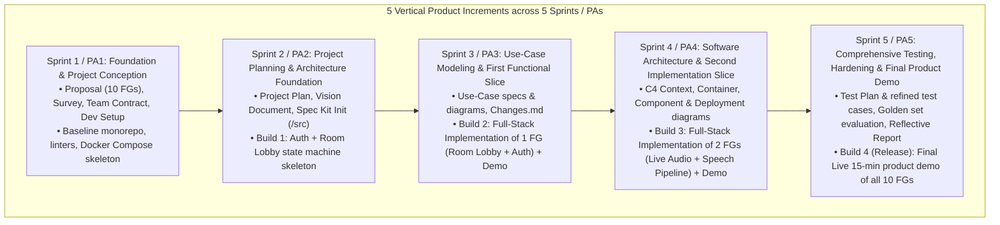

# Part E: Development Tools & Process Setup — DebateSpeak AI

| Field | Description |
|---|---|
| Course | CS300 / CSC13002 — Introduction to Software Engineering |
| Document | **Part E: Scrum Process, Engineering Tooling Setup & Multi-Sprint WBS** |
| Score Allocation | Part E (5 Points) |

---

## 1. Scrum Methodology & Incremental Development Strategy (5 Sprints = 5 PAs)

Our team adheres strictly to the **Agile Scrum framework combined with an Incremental Development model** structured across **5 Sprints**, corresponding directly to the 5 course Project Assignments (PA1–PA5):



### Incremental Development Principles
1. **Vertical Slices Over Horizontal Layers:** Each increment integrates frontend UI, backend logic, and database persistence so that the increment is immediately testable by end users.
2. **Continuous Integration & Regression Guarding:** Code from each increment is merged into `develop` only after automated tests pass. Existing working functionality is never broken to support upcoming increments.
3. **Spec Kit & Traceability:** Starting from PA2 initialization, Spec Kit artifacts guide feature implementations with strict traceability from use cases to tests.

```mermaid
graph LR
    subgraph Sprint Cadence (2-3 Weeks)
        SP[Sprint Planning<br/>Day 1] --> S1[Scrum Meeting 1<br/>Mid-Week 1]
        S1 --> S2[Scrum Meeting 2<br/>Mid-Week 2]
        S2 --> SR[Sprint Review & Retro<br/>Final Day]
    end
```

- **Sprint Planning Meeting (Day 1 of Sprint):** Review course PA requirements, decompose backlog into Jira user stories, estimate story points, and commit to the Sprint Backlog.
- **Scrum Check-ins (2 Meetings per Sprint):** Held mid-week to evaluate progress against the sprint burndown chart, identify emerging technical blockers, and coordinate API contracts.
- **Sprint Review & Retrospective (Final Day of Sprint):** Demonstrates working software against acceptance criteria, conducts an honest team retrospective, and compiles PA submission artifacts.

---

## 2. Jira Task Management Standards

The team utilizes **Jira** for end-to-end task tracking following strict course guidelines:

1. **Complete Project Logging:** All activities—including coding, writing documentation reports, research spikes, self-training, and setting up CI pipelines—are logged as formal Jira issues.
2. **Single Assignee Invariant:** Every Jira issue is assigned to **exactly one team member** (no shared tickets). Collaborative tasks are decomposed into distinct paired sub-tasks.
3. **Strict Date Progression:**
   - Every issue records an explicit **Creation Date**, **Assignment Date**, and **Completion Date**.
   - Tasks are created and assigned *during Sprint Planning before work begins*.
   - Tasks are completed individually as work finishes throughout the sprint—**no batch completions at the end of sprints**.
4. **Task Estimates:** Every task has an initial Story Point estimate (1, 2, 3, 5, 8) and an assigned priority (`BLOCKER`, `CRITICAL`, `MAJOR`, `MINOR`).

---

## 3. Git Workflow & Version Control Invariants

- **Branching Strategy (Git Flow):**
  - `main`: Production-ready, stable releases (tagged `v1.0-pa1`, `v2.0-pa2`, etc.). Protected branch; direct pushes prohibited.
  - `develop`: Shared integration branch for active sprint development.
  - `feature/<jira-key>-<short-description>`: Individual feature branches branched off `develop`.
  - `bugfix/<jira-key>-<short-description>`: Defect fixes branched off `develop`.
- **Pull Request Rules:**
  - Every PR requires passing automated CI checks (linting, tests, build).
  - Every PR requires at least **one approved code review** from a designated peer reviewer before merging.
- **Environment Agnostic & Secret Invariants:**
  - **Zero Hardcoded Absolute Paths:** Dynamic relative paths or environment configurations only.
  - **Zero Secret Leaks:** `.env` is strictly git-ignored; only sanitized `.env.example` is committed.

---

## 4. Spec-Driven Development & Spec Kit Integration

- In accordance with course guidelines, the team adopts **Specification-Driven Development** starting from PA1 and preparing for **Spec Kit** initialization in PA2 (in `/src`).
- Before code implementation begins on any feature:
  1. A formal specification (data models, Pydantic schemas, API route contracts, and edge cases) is written and reviewed in `docs/architecture/SOFTWARE_ARCHITECTURE_SPEC.md`.
  2. Test cases and acceptance criteria are authored in `docs/testing/TESTING_PLAN.md`.
  3. AI coding assistants (GitHub Copilot / Cursor) are constrained using these specifications as prompt context, ensuring code generation directly adheres to architecture invariants.

---

## 5. AI Coding Tooling & Educational Accounts

All 5 team members have registered and verified educational developer accounts:
- **GitHub Copilot for Students:** Activated via the GitHub Student Developer Pack on university email domains (`@hcmus.edu.vn`). Used for inline autocompletion and unit test scaffolding.
- **Cursor IDE / Antigravity:** Configured with local project context (`AGENTS.md`, `.cursorrules`) to assist with full-stack refactoring, FastAPI schema validation, and React component styling under strict quote-grounding constraints.

---

## 6. Sprint 1 Work Breakdown Structure (PA1 Tasks)

| Task Key | Task Summary | Assignee | Issue Type | Story Points | Target Completion |
|---|---|---|---|---|---|
| `DSP-1` | Author Project Proposal & 10 Functional Groups | Nguyễn Bảo Minh Triết (24125047) | Documentation | 5 pts | Week 1, Day 4 |
| `DSP-2` | Conduct Existing App Survey (ArguFight, Khaos Live, ELSA Speak) | Nguyễn Hồng Tấn Tài (24125078) | Research/Doc | 5 pts | Week 1, Day 6 |
| `DSP-3` | Draft Team Contract & Accountability Guidelines | Nguyễn Anh Khoa (24125058) | Documentation | 3 pts | Week 2, Day 2 |
| `DSP-4` | Author Software Architecture & System Spec Document | Trần Lê Anh Tuấn (24125107) | Technical Spec| 8 pts | Week 2, Day 4 |
| `DSP-5` | Initialize Git Monorepo, Directory Hierarchy & CI Linters | Nguyễn Đình Thiên Lộc (24125093) | DevOps/Setup | 3 pts | Week 1, Day 3 |
| `DSP-6` | Setup Docker Compose (PostgreSQL, Redis, LiveKit dev) | Nguyễn Đình Thiên Lộc (24125093) | DevOps/Setup | 3 pts | Week 2, Day 3 |
| `DSP-7` | Verify Educational AI Coding Accounts (Copilot/Cursor) | All | Administrative | 1 pt | Week 1, Day 2 |
| `DSP-8` | Setup `latexmk` pipeline & compile academic PA1 report | Nguyễn Đình Thiên Lộc (24125093) | Management | 2 pts | Week 2, Day 5 |
| `DSP-9` | Compile PA1 Markdown Package & Export Submission PDFs | Nguyễn Bảo Minh Triết (24125047) | Management | 2 pts | Week 2, Day 6 |
