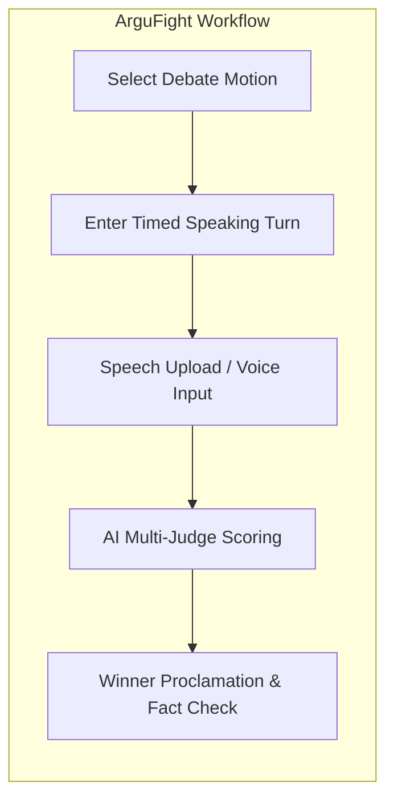
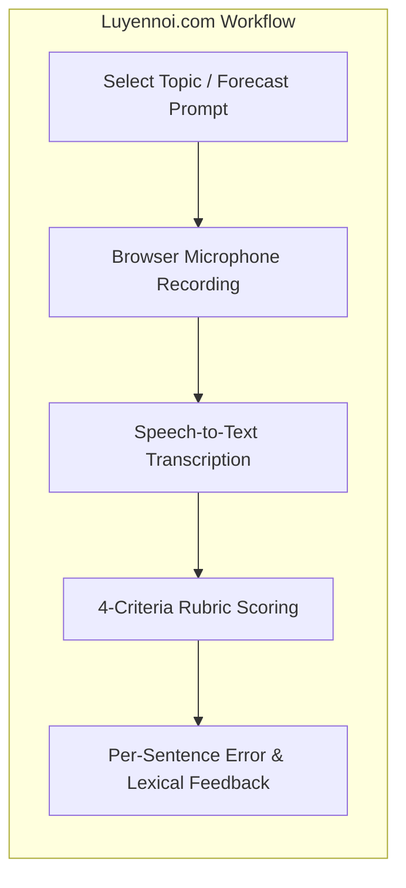

# Part C: Existing App Survey — DebateSpeak AI

| Field | Description |
|---|---|
| Course | CS300 / CSC13002 — Introduction to Software Engineering |
| Document | **Part C: Existing Web & Mobile App Survey** |
| Score Allocation | Part C (10 Points) |

---

## 1. Survey Methodology & App Selection

To evaluate the current state of market solutions and identify architectural and user experience gaps, our team surveyed existing platforms operating at the intersection of AI debate judging, live speech transcription, and English speaking practice.

We selected **two primary directly comparable platforms**:
1. **ArguFight:** A modern web-based debate platform featuring AI judging, voice input, and automated claim verification.
2. **Luyennoi.com (Luyện Nói):** A popular browser-based spoken English & IELTS Speaking training platform featuring automated 4-criteria rubric scoring and per-sentence feedback.

Additionally, we benchmarked against **two industry reference systems**:
1. **ELSA Speak:** A leading mobile-first AI pronunciation coach, analyzing acoustic phoneme feedback and solo drill UX patterns.
2. **Google Meet with Gemini ("Take notes for me" / Meeting Summary):** Google Workspace's flagship enterprise video/audio platform, analyzing real-time multi-speaker transcription, speaker attribution, and asynchronous post-call LLM synthesis.

---

## 2. In-Depth Survey: App 1 — ArguFight

### 2.1 Overview & Core Focus
**ArguFight** focuses on structured, competitive online debates. It allows participants to debate motions either through text or asynchronous voice inputs and employs multiple AI judges to evaluate which debater presented the stronger case.

### 2.2 Key Features & Workflow Analysis



1. **Structured Turn System:** Users speak or type in fixed, alternating rounds (Constructive Speech, Cross-Examination, Rebuttal).
2. **AI Panel of Judges:** The platform simulates a panel of diverse judges (e.g., "The Logician", "The Empiricist", "The Pragmatist") who deliver a consolidated score.
3. **Automated Fact-Checking:** Flags suspicious factual claims made by participants and checks them against internal knowledge bases.

### 2.3 User Interface & Screenshots

#### Screen 1: Debate Matchmaking & Motion Selection
```text
+-------------------------------------------------------------------+
|  ARGUFIGHT                          [Search Motions]  (Profile)   |
|-------------------------------------------------------------------|
|  ACTIVE DEBATES                                                   |
|  +-----------------------------------+  +-----------------------+ |
|  | Motion: "AI will replace coders"  |  | Round: Rebuttal (2/3) | |
|  | Pro: User_Alpha | Con: User_Beta  |  | Time Left: 01:45      | |
|  +-----------------------------------+  +-----------------------+ |
|  [Join Match]  [Spectate Live]                                    |
+-------------------------------------------------------------------+
```
*Caption 1.1: ArguFight Motion Directory — Displays active and upcoming debate matches with round timers and competitive matchmaking status.*

#### Screen 2: Multi-Judge Scoring Breakdown
```text
+-------------------------------------------------------------------+
|  ARGUFIGHT POST-MATCH BREAKDOWN                                    |
|-------------------------------------------------------------------|
|  WINNER: User_Alpha (Pro) - Final Score: 87 vs 74                 |
|                                                                   |
|  [Judge: The Logician]                                            |
|  - Logic & Consistency: 90/100                                    |
|  - Critique: "Pro successfully pointed out Con's circular logic." |
|                                                                   |
|  [Judge: The Empiricist]                                          |
|  - Fact-Check Result: 2 Claims Verified, 1 Claim Flagged (Weak)  |
+-------------------------------------------------------------------+
```
*Caption 1.2: ArguFight Post-Match Verdict — Shows competitive scorecard with independent AI judge opinions, winner selection, and fact validation.*

### 2.4 Strengths & Limitations
- **Strengths:** Excellent multi-judge roleplay exposing varied reasoning perspectives; strong gamification and competitive motivation.
- **Limitations:** Focuses exclusively on *who won the debate*; provides **zero language-learning feedback** (no grammar correction, no CEFR vocabulary recommendations, no pause/fluency analytics). Asynchronous turn-taking feels mechanical and lacks spontaneous conversational flow.

---

## 3. In-Depth Survey: App 2 — Luyennoi.com (Luyện Nói)

### 3.1 Overview & Core Focus
**Luyennoi.com** is a Vietnamese browser-based AI platform designed for English learners and IELTS Speaking candidates. It operates directly inside web browsers (Chrome, Safari, Edge) without requiring app installation, providing automated band scoring across the 4 official IELTS Speaking criteria and per-sentence linguistic feedback.

### 3.2 Key Features & Workflow Analysis



1. **In-Browser Audio Recording:** Direct browser-based Web Audio capture with countdown timers simulating IELTS speaking rounds.
2. **4-Criteria Automated Scoring:** Evaluates user speech against Fluency & Coherence, Lexical Resource, Grammatical Range & Accuracy, and Pronunciation.
3. **Per-Sentence Remediation:** Displays transcribed sentences with underlined grammatical errors and suggests upgraded CEFR/academic vocabulary.
4. **"Lớp Nói" Classroom Management:** Offers teacher/tutor portals to assign speaking prompts and review student submission histories.

### 3.3 User Interface & Screenshots

#### Screen 1: In-Browser Speaking Practice & Recording
```text
+-------------------------------------------------------------------+
|  LUYENNOI.COM                     [Forecast 2026]  [Lớp Nói] (User)|
|-------------------------------------------------------------------|
|  TOPIC: "Describe an environmental problem in your city"          |
|  Part: IELTS Speaking Part 2 | Prep Time: 00:00 | Speaking: 01:42 |
|                                                                   |
|  [|||||||||||||||||||||||||||..........] (Recording Active)       |
|                                                                   |
|  [Finish & Score Now]                                             |
+-------------------------------------------------------------------+
```
*Caption 2.1: Luyennoi.com Recording Interface — Clean web-first recording interface with timed countdown and visual audio waveform.*

#### Screen 2: 4-Criteria Scorecard & Sentence-Level Corrections
```text
+-------------------------------------------------------------------+
|  OVERALL BAND ESTIMATE: 6.5                                       |
|-------------------------------------------------------------------|
|  [Fluency: 6.0]   [Lexical: 7.0]   [Grammar: 6.0]   [Pronun: 6.5] |
|-------------------------------------------------------------------|
|  SENTENCE-BY-SENTENCE REMEDIATION:                                |
|  - Sentence 2: "In my city, traffic cause severe air pollution."   |
|    ❌ Error: Subject-verb agreement ('traffic cause' -> 'causes')  |
|    💡 Vocabulary Upgrade: 'severe' -> 'detrimental'               |
|                                                                   |
|  - Sentence 4: "Government should invest more in bus."             |
|    ❌ Error: Missing plural/determiner ('buses' or 'public transit')|
+-------------------------------------------------------------------+
```
*Caption 2.2: Luyennoi.com Scorecard — Granular diagnostic breakdown across 4 standardized rubrics paired with verbatim sentence corrections.*

### 3.4 Strengths & Limitations
- **Strengths:** Zero installation friction (web-first); direct alignment with standardized test rubrics (IELTS 4 criteria); actionable per-sentence feedback quoting learner speech; tailored specifically to Vietnamese English learners.
- **Limitations:** Strictly **solo, monologue-based practice** against static prompts; **zero real-time interactive dialogue or peer debate**; cannot train spontaneous rebuttal, conversational turn-taking, or real-time active listening; no logical argumentation structure analysis or empirical fact-checking.

---

## 4. Industry Reference Benchmarks

### 4.1 Benchmark 1: ELSA Speak
- **Focus:** Mobile-first English pronunciation and acoustic phoneme analysis.
- **Key Relevance to DebateSpeak:** Demonstrates optimal UX patterns for phoneme-level speech feedback, syllable stress visualization, and longitudinal proficiency tracking.
- **Limitation:** Purely solo phoneme drills; lacks spontaneous conversational context and argumentative reasoning.

### 4.2 Benchmark 2: Google Meet with Gemini ("Take notes for me" / Meeting Summary)
- **Focus:** Enterprise video conferencing powered by Gemini in Google Workspace.
- **Key Capabilities:**
  1. **Deterministic Speaker Attribution & Streaming Captions:** Isolates multi-party audio streams and renders real-time diarized captions with speaker tags.
  2. **Asynchronous Post-Call Synthesis ("Take notes for me"):** Automatically extracts core discussion threads, decisions made, and assigned action items into a structured Google Doc.
  3. **Live "Summary so far":** In-call catch-up synthesis allowing participants to read what transpired before they joined.
- **Visual Interface Analysis (Survey Artifacts):**
  - **Pre-Call & Entry ([`screenshots/join_screen.png`](../../screenshots/join_screen.png)):** Shows seamless mic/camera device selection with Gemini intelligence enabled.
  - **In-Call Orchestration ([`screenshots/in-meeting.png`](../../screenshots/in-meeting.png)):** Displays active in-meeting transcription indicator where Gemini unobtrusively captures live speech without intruding into the conversation.
  - **Post-Call Structured Artifacts ([`screenshots/email_1.png`](../../screenshots/email_1.png), [`screenshots/email_2.png`](../../screenshots/email_2.png)):** Shows automated email notifications delivering structured meeting summaries, grouped discussion topics, and clear action items directly to participants' inboxes and Google Drive.
- **Key Relevance to DebateSpeak:**
  - **Non-Intrusive Background Orchestration:** Demonstrates that AI should listen quietly in the background during live human communication without introducing cognitive disruption or audio latency.
  - **Asynchronous LLM Multi-Agent Pipeline:** Mirrors DebateSpeak's design where deep analytical extraction (Language, Argument, Fact-Checking) runs asynchronously after the speaking session ends.
- **Limitation:** Designed for corporate productivity and action item tracking; provides **zero language-learning pedagogy** (no CEFR grammar or vocabulary analysis), no speech fluency profiling (WPM, pause durations, fillers), and no fact-checking of claims made.

---

## 5. Comparative Synthesis & Differentiation

### 5.1 Comprehensive Feature Matrix

| Evaluation Dimension | ArguFight | Luyennoi.com | ELSA Speak | Google Meet + Gemini | **DebateSpeak AI (Proposed)** |
|---|---|---|---|---|---|
| **Core Primary Purpose** | Competitive debate game | Solo IELTS speaking drills | Solo pronunciation practice | Enterprise meeting productivity | **Spoken English learning & critical-thinking debate** |
| **Interaction Format** | Asynchronous audio/text turns | Solo recording on web | Solo phoneme drills | Multi-party live video meeting | **Synchronous live peer debate (2 debaters in room)** |
| **Audio Routing Architecture** | Uploaded audio files | Browser Web Audio recording | Native mobile audio recording | WebRTC media routing | **LiveKit Cloud SFU (low-latency WebRTC peer audio)** |
| **Language Pedagogy (CEFR)** | None | Yes (IELTS 4 criteria) | Yes (Pronunciation/Acoustic) | None | **Yes (CEFR A2–C1 grammar, vocab breadth & fluency)** |
| **Spoken Fluency Metrics** | None | High-level fluency band | Phoneme/syllable accuracy | None | **WPM, filler rate, pause profile, lexical diversity (MATTR)** |
| **Argument Structure Analysis** | Judge roleplay text | None | None | Topic clustering | **Claim extraction, rebuttal mapping, fallacy detection** |
| **Fact-Checking Mechanism** | Internal knowledge base | None | None | None | **Live search retrieval (Serper/Tavily) + Skeptic consensus** |
| **Post-Session Output** | Win / Loss verdict | Scorecard + sentence tips | Pronunciation scorecard | Meeting notes & action items | **Personalized action plan with verbatim quote corrections** |

### 5.2 Key Differentiators for DebateSpeak AI
1. **Learning-First Debate Vehicle:** Unlike ArguFight (competitive game) and Google Meet (corporate notes), DebateSpeak uses debate purely as an *educational vehicle* to elicit unscripted, spontaneous speech from language learners.
2. **From Solo Cramming to Live Interaction:** Unlike Luyennoi.com and ELSA Speak where learners practice monologues in isolation, DebateSpeak introduces real-time peer dialogue where learners must listen actively, think on their feet, and formulate rebuttals.
3. **Strict Quote-Grounded Remediation:** Adopting Luyennoi.com's strength of citing learner sentences, DebateSpeak's **Grounding Guard** guarantees 100% of feedback items cite verbatim transcript quotes from the debate, eliminating AI hallucinations.
4. **Empirical Fact-Checking with Transparency:** DebateSpeak goes beyond opinionated scoring by verifying check-worthy claims through live search engines, presenting transparent source URLs, and flagging contested claims.

### 5.3 UI/UX Patterns Adopted from Surveyed Systems
- **From Luyennoi.com:** We adopt the **zero-install web-first audio experience** and the **quote-grounded sentence remediation pattern**, showing learners exactly what they said alongside targeted corrections.
- **From Google Meet with Gemini:** We adopt the **non-intrusive background listener architecture**, where live WebRTC audio streams quietly to backend transcription workers while deep multi-agent evaluation runs asynchronously to produce structured summaries.
- **From ArguFight:** We adopt the **multi-perspective evaluation layout**, presenting distinct coach analyses (Language, Argument, Fact-Checking) as organized, tabbed scorecards.
- **From ELSA Speak:** We adopt the **longitudinal progress visualizer**, tracking speaking speed, filler frequency, and vocabulary growth across debate rounds over time.
